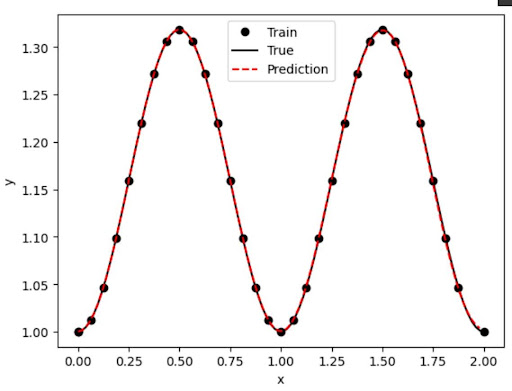

# Differential Equation Solver

**Members**  
Eve Zeng · Chau Vu · Dualeh² · Sultan Aldawodi

Abstract

Physics‐informed neural networks (PINNs) offer a mesh‐free, data‐efficient approach to obtaining approximate solutions of ordinary differential equations (ODEs) by embedding the governing equations directly into the loss function of a neural network. In this project, we compare three distinct PINN implementations for solving benchmark ODEs: (i) a from‐scratch fully connected network coded in plain Python, (ii) a Keras‐based PINN leveraging TensorFlow’s high‐level APIs, and (iii) a DeepXDE model utilizing its specialized automatic differentiation and domain-decomposition features. These models were trained to solve simple ODEs, and their results were compared. The Keras and DeepXDE models performed with high accuracy, though the construction of the network needs to be modified with initial conditions to accommodate different scenarios. Still, these networks and their results demonstrate the reliable use of PINNs to solve ordinary differential equations and have a promising future in tackling complex partial differential equations with no analytical solutions.

Introduction

ODEs (ordinary differential equations) are an important way of modeling the world in different fields such as economics, biology, and physics. For example, the physics of fluid dynamics is governed by the Navier–Stokes partial differential equations. Having accurate solutions to these equations gives power in analyzing complex systems. Our project focuses on testing a branch of neural network formalism called PINN (Physics‐informed neural networks) in its ability to solve differential equations, such that these equations produce simple and accurate results for difficult problems. Some of the hardest differential equations cannot be analytically solved, so having a reliable approximate solution from a neural network can help build complex models and systems. Our project tests three different kinds of PINNs, starting with a simple, made-from-scratch model using a fully connected neural network, then a Keras PINN via TensorFlow, and finally a DeepXDE model. Our tests on simple ODEs show promising signs for tackling more complex PDEs in future work.

Ethics Discussion

Our project seeks to go beyond academic research by making our findings accessible through an interactive web interface, ensuring that anyone can use the program upon publishing our results. We understand there is the risk of students misusing this program in ways that violate school policies, such as cheating and plagiarism, but the applicability of this program in helping students learn and understand differential equations outweighs the chances of misuse, as it provides a learning opportunity for people who may not have access to advanced calculators.

Related Work

Prior research has explored various methods for solving ODEs using neural networks. Some studies introduced PINNs to solve first- and second-order ODEs, highlighting their usefulness in physics simulations and their ability to incorporate physical laws directly into the model’s structure[^1]. Other studies expanded on this method by modifying the loss function to include the differential equation itself, allowing the model to learn to satisfy the equation rather than simply fit example data points[^2]. MathWorks presented a different strategy, using neural networks to produce closed-form approximations of ODE solutions, supported by a training process that involves generating data, defining the network, and customizing the loss function[^3]. Additionally, researchers have applied similar techniques to Partial Differential Equations (PDEs), training models on randomly sampled space and time points to approximate solutions where no analytical answers exist[^4]. Together, these works show the versatility and potential of neural networks in solving both ODEs and PDEs, laying the groundwork for our own project.

  
Methods

  The primary software we use to implement the PINN is TensorFlow and Keras. We will train three PINNs: a manually-built neural network, a Keras-based PINN using automatic differentiation, and a DeepXDE library that automates the setup and training of the neural network. The hand-built network is built using the Dense and Input layers from Keras, with the Adam optimizer used to minimize the loss function, which combines the residual of the differential equation with the error from the initial or boundary conditions.

  For the dataset, we constructed training data by sampling from various ODEs. For example, for the first-order ODE, such as  
  \[
    \frac{dy}{dx} + y = 0,
  \]  
  the exact solution  
  \[
    y(x) = e^{-x}
  \]  

<strong>Discussion</strong>

We are creating our own data set, with methods provided by <a href="https://github.com/rtqichen/torchdiffeq/blob/master/README.md"><i>torchdiffeq</i></a>, and trained our PINN with these specifically generated data set.  
We are implementing this PINN network to train three different data sets, corresponding to three different types of differential equations, based on <a href="https://github.com/rtqichen/torchdiffeq">these tests</a>.  
We will also create a graph visualization to show how well our neural network’s predictions align with the ground truth solutions of the differential equation during the training process.  
After training these Neural Networks, we will again generate another set of data by similar methods, and test each of these three networks on their accuracy.  
We will compare our base type differential equation to the literature results, expecting to perform less accurately due to less data. We will also compare the accuracy between each type of NN, and decipher the potential reasons that one does better or worse.  
In the future, we would spend more time to figure out how to generalize our neural network to more types of equations.

### Results
1. **PINNs built by hand (Non-Keras or XDE):**
   - We found that this version is significantly less accurate than others because:
     + In our loss function, instead of using `tf.GradientTape(u, t)` like the Keras version, we use a finite‐difference stencil dNN ≈ (g(x+ε) − g(x)) / ε, which is slower, less stable, and inherently unreliable. Accuracy critically depends on choosing an optimal \( \epsilon \); if it’s too large, you miss details, and if it’s too small, floating-point noise dominates.
     + We’re not using `tf.keras.Sequential`, a model that has been developed and optimized for these tasks. Instead, we manually define our weights/biases and `tf.matmul` calls, which might be slower and more error-prone during training.

   - For this model, our loss function is designed to use a predefined \( f(x) \) function, which limits the model to solving equations that involve only \( x \). As a result, the model is less flexible because it cannot handle ODEs that include both \( x \) and \( y \) or other variable interactions.

2. **Keras PINNs:**
  - The Keras package has existing functions that provides existing and established NN models. We used the sequential model provided by the Keras package. 
  This model did well with our given example of a Sine wave, the original function and the NN approximation matched each other almost perfectly. 
  However, problems arise when we try other equations that are not periodic. It is hard to normalize the equation when it goes to infinity, but not normalizing it could risk other problems to the activation function blowing up or going to zero. Thus, this is a problem that needs to be addressed for a better model of training all kinds of differential equation NN, not just the periodic ones. 

  

    
    
  

3. **DeepXDE PINNs:**
  <b>DeepXDE output for Sin(2*pi*t):</b>
  

    
    
  

  - These results look spot on. The loss curves drop smoothly for both train and test, and the solution plot shows that the PINN learned:  
\( \frac{dy}{dt} = \sin(2\pi t), \quad y(0) = 1 \)  
almost perfectly. The red dashed line overlaps the true black curve and the training dots.

  - Additionally, DeepXDE makes this entire process almost trivial. We can define the ODE, domain, and initial condition in a few lines, and DeepXDE uses TensorFlow’s automatic differentiation to build a loss that enforces the differential equation and boundary conditions. It even lets us plug in an exact solution for immediate error checks. A single call to `dde.saveplot()` then gives us both the loss history and the prediction‑vs‑truth comparison without any extra plotting code.

  - By contrast, if we tried the same thing in Keras or with a hand‑rolled feedforward network, we’d have to write custom loss functions, call gradient routines ourselves, manually sample time points, and wire up all the training loops. DeepXDE abstracts all that away, so we can focus on modeling rather than boilerplate—and for anyone solving ODEs or PDEs, that makes it the fastest, most reliable choice.

Conclusion/Future Work

This project opens up opportunities for potential future work. One key direction we are focusing on is creating better models that can approximate higher-order equations and more complex systems. Another potential feature, given more time, would be to experiment with developing a combined model trained on the results from these individual models, capable of determining which model best fits the function type we are approximating. Additionally, we would like to create a web-based version of our models to showcase our results and more effectively communicate the differences between them.

Reflection

In terms of research, specifically in the field of neural networks, our team learned a lot about PINNs, not only on how to implement these models, but also to compare and contrast their performances. We also trained our skills in finding literature, trying out sample codes, and refactoring these open-source model for our project’s goals. In addition to that, we also learned how to work in a group, plan tasks for everyone, and reprioritize as needed.

In terms of research, specifically in the field of neural networks, our team learned a lot about PINNs, not only on how to implement these models, but also to compare and contrast their performances. We also trained our skills in finding literature, trying out sample codes, and refactoring these open-source model for our project’s goals. In addition to that, we also learned how to work in a group, plan tasks for everyone, and reprioritize as needed. 
## Project Design

Our project distinguishes itself from existing research in neural network-based differential equation solvers through its focus on both pattern matching and Physics-Informed Neural Network (PINN) methodologies. While prior work has explored neural networks for solving ODEs, much of it has concentrated on either direct function approximation or strictly physics-informed approaches. Our approach integrates both perspectives, allowing us to evaluate their respective strengths and limitations in solving ODEs. Additionally, rather than solely focusing on performance benchmarks, we aim to compare how neural network-generated solutions align with traditional human-solving strategies, providing a deeper interpretability component. That way users can both get a solution to a differential equation and see the steps taken to solve it. That way, even if the solution is incorrect, the user can still find where the neural network went wrong through visual compute graphs.

## References

[^1]: Amini, S., Hashemi, A., Azizi, A., & Ebrahimi, H. (2023). *Solving differential equations with Deep Learning: A beginner’s guide*. arXiv preprint arXiv:2302.12260. [View paper](https://arxiv.org/abs/2302.12260)

[^2]: Zang, Y., Bao, G., Ye, X., & Zhou, H. (2020). *Weak adversarial networks for high-dimensional partial differential equations*. Neurocomputing, 399, 305–315. [View paper](https://www.sciencedirect.com/science/article/abs/pii/S0925231220301909)

[^3]: MathWorks. (n.d.). *Solve ODEs Using a Neural Network*. [View paper](https://www.mathworks.com/help/deeplearning/ug/solve-odes-using-a-neural-network.html)

[^4]: Raissi, M., Perdikaris, P., & Karniadakis, G. E. (2019). *Physics-informed neural networks: A deep learning framework for solving forward and inverse problems involving nonlinear partial differential equations*. *Journal of Computational Physics*, 378, 686–707. [View paper](https://www.sciencedirect.com/science/article/pii/S0021999118305527)

