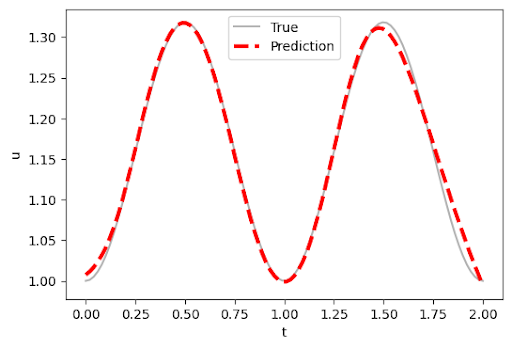

# Differential Equation Solver

**Members**  
Eve Zeng · Chau Vu · Dualeh² · Sultan Aldawodi

Abstract

Physics‐informed neural networks (PINNs) offer a mesh‐free, data‐efficient approach to obtaining approximate solutions of ordinary differential equations (ODEs) by embedding the governing equations directly into the loss function of a neural network. In this project, we compare three distinct PINN implementations for solving benchmark ODEs: (i) a from‐scratch fully connected network coded in plain Python, (ii) a Keras‐based PINN leveraging TensorFlow’s high‐level APIs, and (iii) a DeepXDE model utilizing its specialized automatic differentiation and domain-decomposition features. These models were trained to solve simple ODEs, and their results were compared. The Keras and DeepXDE models performed with high accuracy, though the construction of the network needs to be modified with initial conditions to accommodate different scenarios. Still, these networks and their results demonstrate the reliable use of PINNs to solve ordinary differential equations and have a promising future in tackling complex partial differential equations with no analytical solutions.

Introduction

ODEs (ordinary differential equations) are an important way of modeling the world in different fields such as economics, biology, and physics. For example, the physics of fluid dynamics is governed by the Navier–Stokes partial differential equations. Having accurate solutions to these equations gives power in analyzing complex systems. Our project focuses on testing a branch of neural network formalism called PINN (Physics‐informed neural networks) in its ability to solve differential equations, such that these equations produce simple and accurate results for difficult problems. Some of the hardest differential equations cannot be analytically solved, so having a reliable approximate solution from a neural network can help build complex models and systems. Our project tests three different kinds of PINNs, starting with a simple, made-from-scratch model using a fully connected neural network, then a Keras PINN via TensorFlow, and finally a DeepXDE model. Our tests on simple ODEs show promising signs for tackling more complex PDEs in future work.

Ethics Discussion

Our project seeks to go beyond academic research by making our findings accessible through an interactive web interface, ensuring that anyone can use the program upon publishing our results. We understand there is the risk of students misusing this program in ways that violate school policies, such as cheating and plagiarism, but the applicability of this program in helping students learn and understand differential equations outweighs the chances of misuse, as it provides a learning opportunity for people who may not have access to advanced calculators.

Related Work

Prior research has explored various methods for solving ODEs using neural networks. Some studies introduced PINNs to solve first- and second-order ODEs, highlighting their usefulness in physics simulations and their ability to incorporate physical laws directly into the model’s structure <a href="#ref1">[1]</a>. Other studies expanded on this method by modifying the loss function to include the differential equation itself <a href="#ref2">[2]</a>. MathWorks presented a different strategy, using neural networks to produce closed-form approximations of ODE solutions <a href="#ref3">[3]</a>. Additionally, researchers have applied similar techniques to PDEs, training models on randomly sampled space and time points to approximate solutions where no analytical answers exist <a href="#ref4">[4]</a>. These works show the versatility and potential of neural networks in solving both ODEs and PDEs, laying the groundwork for our own project.

Methods

The primary software we use to implement the PINN is TensorFlow and Keras. We will train three PINNs: a manually-built neural network, a Keras-based PINN using automatic differentiation, and a DeepXDE library that automates the setup and training of the neural network. The hand-built network is built using the Dense and Input layers from Keras, with the Adam optimizer used to minimize the loss function, which combines the residual of the differential equation with the error from the initial or boundary conditions.

For the dataset, we constructed training data by sampling from various ODEs. For example, for the first-order ODE:  
\[
  \frac{dy}{dx} + y = 0,
\]  
The exact solution is:  
\[
  y(x) = e^{-x}
\]

<strong>Discussion</strong>

We are creating our own data set, with methods provided by <a href="https://github.com/rtqichen/torchdiffeq/blob/master/README.md"><i>torchdiffeq</i></a>, and trained our PINN with these specifically generated data set.  
We are implementing this PINN network to train three different data sets, corresponding to three different types of differential equations, based on <a href="https://github.com/rtqichen/torchdiffeq">these tests</a>.  
We will also create a graph visualization to show how well our neural network’s predictions align with the ground truth solutions of the differential equation during the training process.  
After training these Neural Networks, we will again generate another set of data by similar methods, and test each of these three networks on their accuracy.  
We will compare our base type differential equation to the literature results, expecting to perform less accurately due to less data. We will also compare the accuracy between each type of NN, and decipher the potential reasons that one does better or worse.  
In the future, we would spend more time to figure out how to generalize our neural network to more types of equations.

<h3>🔍 Results</h3>

<h4>1. <strong>PINNs built by hand (Non-Keras or XDE)</strong></h4>
<ul>
  <li>We found that this version is significantly less accurate than others because:</li>
  <ul>
    <li>Instead of using <code>tf.GradientTape()</code>, it uses a finite-difference stencil:
      <code>dNN ≈ (g(x+ε) − g(x)) / ε</code>. This is slower, less stable, and affected by floating-point noise.</li>
    <li>We're not using <code>tf.keras.Sequential</code> but hand-coded weights/biases with <code>tf.matmul</code>, which is more error-prone.</li>
  </ul>
  <li>The model can only solve ODEs in terms of \( x \), making it inflexible for ODEs involving both \( x \) and \( y \).</li>
</ul>

  

<h4>2. <strong>Keras PINNs</strong></h4>

  The Keras model performed well on the sinusoidal example. Its prediction closely matches the true function.
  However, non-periodic functions caused issues—particularly due to challenges in normalizing unbounded outputs,
  which risks activation functions exploding or vanishing.

  
  

<h4>3. <strong>DeepXDE PINNs</strong></h4>

  DeepXDE achieved near-perfect results on the ODE:
  \[
    \frac{dy}{dt} = \sin(2\pi t), \quad y(0) = 1
  \]
  The red dashed line (prediction) overlaps the true curve nearly everywhere. DeepXDE also streamlines the entire PINN process,
  letting you define the problem, initial conditions, and even the reference solution in just a few lines.

  
  

  

<strong>DeepXDE Code</strong>

<pre><code>
from deepxde.backend.set_default_backend import set_default_backend
set_default_backend("tensorflow")
import tensorflow as tf
import deepxde as dde
import numpy as np
import matplotlib.pyplot as plt
import math as m

pi = tf.constant(m.pi)

def ode_system(t, u):
    du_t = dde.grad.jacobian(u, t)
    return du_t - tf.math.sin(2 * pi * t)

def boundary(t, on_initial):
    return on_initial and np.isclose(t[0], 0)

geom = dde.geometry.TimeDomain(0, 2)
ic = dde.IC(geom, lambda t: 1, boundary)

def true_solution(t):
    return -tf.math.cos(2 * pi * t) / (2 * pi) + (1 + 1 / (2 * pi))

data = dde.data.PDE(geom, ode_system, ic,
                    num_domain=30,
                    num_boundary=2,
                    solution=true_solution,
                    num_test=100)

layer_size = [1, 32, 32, 1]
activation = "tanh"
initializer = "Glorot uniform"

NN = dde.maps.FNN(layer_size, activation, initializer)
model = dde.Model(data, NN)
model.compile("adam", lr=0.001)
losshistory, train_state = model.train(epochs=3000)
dde.saveplot(losshistory, train_state, issave=False, isplot=True)
</code></pre>

<strong>Keras Code</strong>

<pre><code>
import numpy as np
import matplotlib.pyplot as plt
import tensorflow as tf

tf.compat.v1.enable_eager_execution()
import warnings
warnings.filterwarnings("ignore")

NN = tf.keras.models.Sequential([
    tf.keras.layers.Input((1,)),
    tf.keras.layers.Dense(32, activation='tanh'),
    tf.keras.layers.Dense(32, activation='tanh'),
    tf.keras.layers.Dense(1)
])

optm = tf.keras.optimizers.Adam(learning_rate=0.001)

def ode_system(t, net):
    t = t.reshape(-1, 1)
    t = tf.constant(t, dtype=tf.float32)
    t_0 = tf.zeros((1, 1))
    one = tf.ones((1, 1))

    with tf.GradientTape() as tape:
        tape.watch(t)
        u = net(t)
        u_t = tape.gradient(u, t)

    ode_loss = u_t - tf.math.sin(2 * np.pi * t)
    IC_loss = net(t_0) - one
    square_loss = tf.square(ode_loss) + tf.square(IC_loss)
    return tf.reduce_mean(square_loss)

train_loss_record = []

for itr in range(3000):
    train_t = (np.random.rand(20) * 2).reshape(-1, 1)
    with tf.GradientTape() as tape:
        train_loss = ode_system(train_t, NN)
        train_loss_record.append(train_loss)
        grad_w = tape.gradient(train_loss, NN.trainable_variables)
        optm.apply_gradients(zip(grad_w, NN.trainable_variables))
    if itr % 1000 == 0:
        print(f'Epoch: {itr}, Loss: {train_loss.numpy():.4f}')

plt.plot(train_loss_record)
plt.title("Training Loss")
plt.xlabel("Epochs")
plt.ylabel("Loss")
plt.show()

test_t = np.linspace(0, 2, 100)
test_t_tensor = tf.constant(test_t, dtype=tf.float32)

pred_u = NN(test_t_tensor).numpy()
true_u = -np.cos(2 * np.pi * test_t) / (2 * np.pi) + (1 + 1 / (2 * np.pi))

plt.plot(test_t, true_u, label='True', alpha=0.5)
plt.plot(test_t, pred_u, '--r', label='Prediction')
plt.legend()
plt.xlabel('t')
plt.ylabel('u')
plt.title('Prediction vs Ground Truth')
plt.show()
</code></pre>

<strong>PINNs Built by Hand (Non-Keras or XDE)</strong>

<pre><code>
import tensorflow as tf
import numpy as np

f0 = 1
inf_s = np.sqrt(np.finfo(np.float32).eps)

learning_rate = 0.01
training_steps = 500

n_input, n_hidden_1, n_hidden_2, n_output = 1, 32, 32, 1

weights = {
    'h1': tf.Variable(tf.random.normal([n_input, n_hidden_1])),
    'h2': tf.Variable(tf.random.normal([n_hidden_1, n_hidden_2])),
    'out': tf.Variable(tf.random.normal([n_hidden_2, n_output]))
}
biases = {
    'b1': tf.Variable(tf.random.normal([n_hidden_1])),
    'b2': tf.Variable(tf.random.normal([n_hidden_2])),
    'out': tf.Variable(tf.random.normal([n_output]))
}

optimizer = tf.optimizers.SGD(learning_rate)

def multilayer_perceptron(x):
    x = np.array([[x]], dtype='float32')
    layer_1 = tf.nn.sigmoid(tf.add(tf.matmul(x, weights['h1']), biases['b1']))
    layer_2 = tf.nn.sigmoid(tf.add(tf.matmul(layer_1, weights['h2']), biases['b2']))
    output = tf.matmul(layer_2, weights['out']) + biases['out']
    return output

def g(x):
    return x * multilayer_perceptron(x) + f0

pi = tf.constant(np.pi)
def f(x):
    return tf.math.sin(2 * pi * x)

def custom_loss():
    xs = np.random.rand(20)
    errors = []
    for x in xs:
        dNN = (g(x + inf_s) - g(x)) / inf_s
        errors.append((dNN - f(x)) ** 2)
    return tf.reduce_sum(errors)

def train_step():
    with tf.GradientTape() as tape:
        loss = custom_loss()
    variables = list(weights.values()) + list(biases.values())
    gradients = tape.gradient(loss, variables)
    optimizer.apply_gradients(zip(gradients, variables))

for _ in range(training_steps):
    train_step()
</code></pre>

Conclusion/Future Work

This project opens up opportunities for future work. We aim to create better models that handle higher-order and complex systems.  
One idea is to combine the strengths of different models into a meta-model that selects the best PINN for a given equation.  
We also plan to build a web-based demo to showcase the models and compare performance.

Reflection

Our team learned not only how to implement PINNs but also how to research, collaborate, and plan development work.  
We improved our literature review skills, modified open-source models, and compared performance across different approaches.  
This project also helped us learn to work as a group and prioritize tasks.

---

## References

<ol>
  <li id="ref1">
    Amini, S., Hashemi, A., Azizi, A., & Ebrahimi, H. (2023). <i>Solving differential equations with Deep Learning: A beginner’s guide</i>. <a href="https://arxiv.org/abs/2302.12260" target="_blank">arXiv</a>.
  </li>
  <li id="ref2">
    Zang, Y., Bao, G., Ye, X., & Zhou, H. (2020). <i>Weak adversarial networks for high-dimensional partial differential equations</i>. <a href="https://www.sciencedirect.com/science/article/abs/pii/S0925231220301909" target="_blank">Neurocomputing</a>.
  </li>
  <li id="ref3">
    MathWorks. <i>Solve ODEs Using a Neural Network</i>. <a href="https://www.mathworks.com/help/deeplearning/ug/solve-odes-using-a-neural-network.html" target="_blank">Documentation</a>.
  </li>
  <li id="ref4">
    Raissi, M., Perdikaris, P., & Karniadakis, G. E. (2019). <i>Physics-informed neural networks: A deep learning framework for solving forward and inverse problems involving nonlinear partial differential equations</i>. <a href="https://www.sciencedirect.com/science/article/pii/S0021999118305527" target="_blank">Journal of Computational Physics</a>.
  </li>
</ol> 
- [DeepXDE Documentation](https://deepxde.readthedocs.io/en/latest/)  
- [Keras Model API](https://keras.io/api/models/model/)  
- [Hand‑built PINN Colab Example](https://colab.research.google.com/drive/12ztGwxR1TK8Ka6H3bOsSt57kB71ieQ-W?usp=sharing)  
- [Keras & DeepXDE Comparison Colab](https://colab.research.google.com/drive/1L1EmfOFFnoXfCF8YwNxkCflEV0gAScqx?usp=sharing)

